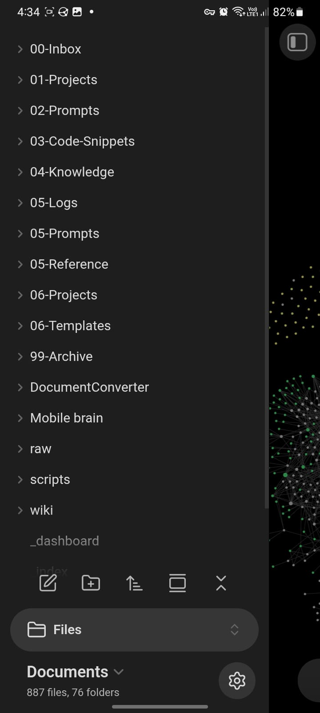
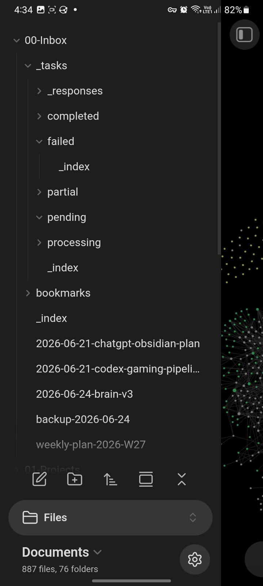
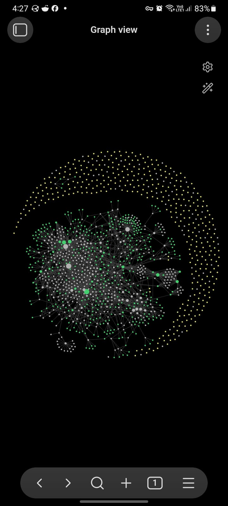

# AI Dev Brain Kit

A local-first memory system for solo developers. Capture notes, log daily
activity, build session context for AI tools, and consolidate raw captures
into durable knowledge — all on your own machine.

## Features

- **Quick capture** — `brain note "remember this"` from anywhere
- **Daily logs** — `brain today` appends to your daily journal
- **AI context** — `brain context --clipboard` builds a prompt-ready summary
  of recent activity for your AI coding session
- **Consolidate & review** — stage inbox items, review interactively, approve
  or reject — no data leaves your machine unless you opt into LLM help
- **Claude Code hook** — auto-capture session summaries when Claude stops
- **Obsidian graph view** — interactive knowledge graph of all captured notes, decisions, and logs
- **Zero telemetry** — no phone-home, no analytics, no accounts

## Requirements

- **Linux** (x86_64) or **Windows 10/11** (x86_64)
- No Python, Node, or runtime dependencies — the binary is self-contained

> **Windows status:** Windows x86_64 binary is included. Linux clean-env installer
> verification passed; Windows user feedback/testing is still requested.
> Known limitations: clipboard integration (`xclip`/`xsel` only; `clip.exe` not wired);
> x86_64 only.

## Installation

```bash
# Linux
curl -fsSL https://github.com/MohamedHussien-zseeker/ai-dev-brain-kit/releases/latest/download/install.sh | bash
source ~/.bashrc

# Windows (PowerShell)
powershell -c "Invoke-WebRequest -Uri https://github.com/MohamedHussien-zseeker/ai-dev-brain-kit/releases/latest/download/install.ps1 -OutFile install.ps1; .\install.ps1"
```

Or download the binary from [releases](https://github.com/MohamedHussien-zseeker/ai-dev-brain-kit/releases),
verify the SHA-256 checksum, and place it on your PATH.

Full install details: [docs/QUICKSTART.md](docs/QUICKSTART.md)

## Quick Start

```bash
# Initialize a vault (use your existing Obsidian vault or create fresh)
brain init --vault ~/my-brain

# Capture a thought
brain note "Check the API rate limits before deploying"

# Log your day
brain today

# Build AI session context
brain context --clipboard
```

## Core Commands

| Command | Description |
|---|---|
| `brain init` | Create vault and configuration |
| `brain note <text>` | Capture a quick note |
| `brain today` | Daily log entry |
| `brain context` | Build session context from vault |
| `brain doctor` | Health check |
| `brain consolidate` | Stage inbox items for review |
| `brain review` | Review proposals interactively |
| `brain review-stats` | Pending/approved/rejected counts |
| `brain hook install` | Install Claude Code stop hook |

## Privacy & Security

- **Local-first**: all data stays in your vault directory
- **No telemetry**: brain never phones home
- **LLM is opt-in**: `--llm` flag required to send content to any provider
- **API keys**: read from `AI_BRAIN_KEY` env var, never written to disk
- **SHA-256**: all releases are checksum-verified

See [docs/PRIVACY.md](docs/PRIVACY.md) and [docs/SECURITY.md](docs/SECURITY.md).

## Screenshots


*Vault root — PARA-style folders for inbox, projects, decisions, and logs.*


*Task inbox processing — captures, plans, and templates organized by workflow stage.*


*Every note, decision, and log entry is a node. Edges show how daily work, prompts, and decisions relate.*

[Demo video — Graph View in action](docs/assets/screenshots/demo.mp4)
*22-second screen recording of the knowledge graph.*

## Documentation

| Document | Description |
|---|---|
| [QUICKSTART.md](docs/QUICKSTART.md) | Install & first workflow |
| [CUSTOMER_HANDBOOK.md](docs/CUSTOMER_HANDBOOK.md) | What pilot customers get |
| [PRIVACY.md](docs/PRIVACY.md) | Data handling & privacy |
| [SECURITY.md](docs/SECURITY.md) | Binary integrity, key safety |
| [REMOTE_INSTALL.md](docs/REMOTE_INSTALL.md) | Remote setup instructions |
| [UNINSTALL.md](docs/UNINSTALL.md) | How to remove |

## Status

**v0.2.2 GA**

AI Dev Brain Kit v0.2.2 is the current GA release. Linux installer verification
has passed in a clean environment. Windows feedback is welcome.

## Support

- Open a [GitHub issue](https://github.com/MohamedHussien-zseeker/ai-dev-brain-kit/issues)
- Pilot customers: contact your setup engineer directly
